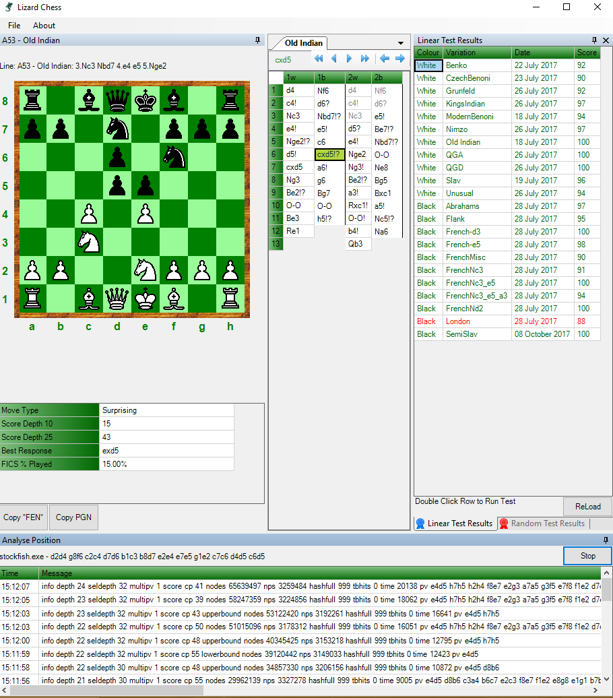

# Lizard

This project contains a tools to manage chess openings and some other chess utilities.

This program was built using Visual Studio 2017.

## Build Status

## Maintainer(s)

- [Phil Brooks](https://github.com/pbbwfc)
